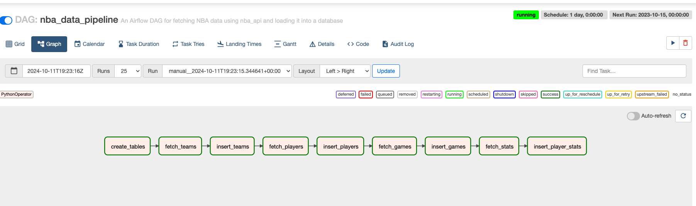
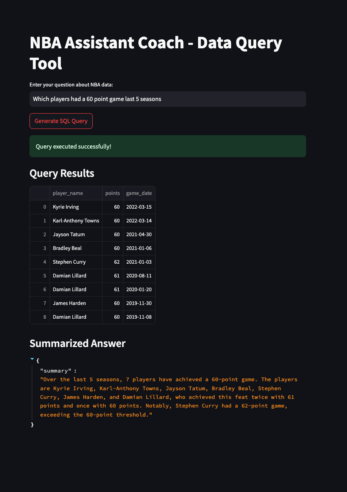
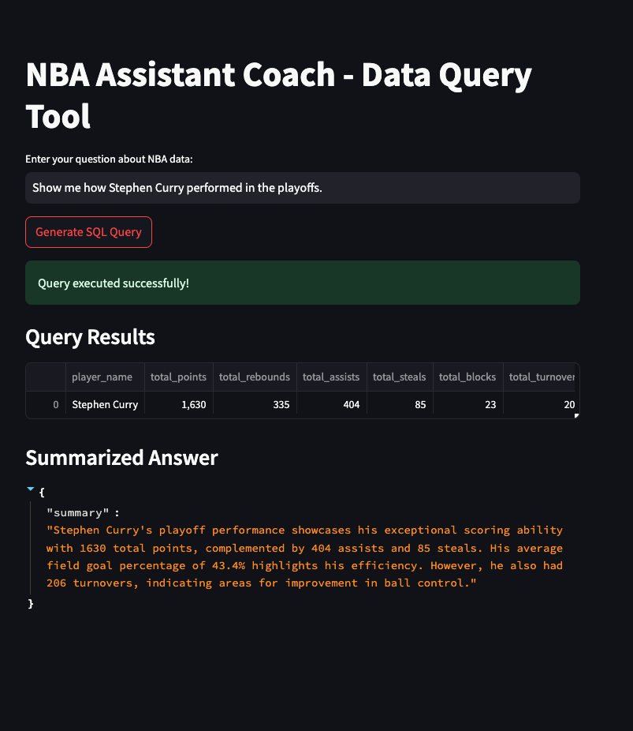

# NBA Assistant Coach - Data Query Tool

Welcome to the **NBA Assistant Coach - Data Query Tool** project! This tool leverages data from the NBA, Groq's open-source LLM, and LangChain to help users (like assistant coaches) generate SQL queries, retrieve insights, and present both tabular data and summarized answers through an intuitive Streamlit-based interface.

## Table of Contents
- [Overview](#overview)
- [Project Structure](#project-structure)
- [Features](#features)
- [Data Engineering Pipeline](#data-engineering-pipeline)
- [Getting Started](#getting-started)
- [Setup Instructions](#setup-instructions)
- [Usage](#usage)
- [Technologies Used](#technologies-used)
- [Future Enhancements](#future-enhancements)
- [Contributing](#contributing)
- [License](#license)

## Overview
The NBA Assistant Coach project is designed to simplify and enhance the process of querying NBA data for assistant coaches. It provides:
- An AI-powered SQL query generator using Groq's open-source LLM.
- Automatic generation of SQL queries, even considering unspoken user intents.
- Data visualization through tabular results and natural language summaries in Streamlit.
- A robust data engineering pipeline using Apache Airflow for data ingestion and transformation.

## Project Structure
Here's an overview of the project's folder structure:


```
📦 nba_sql_generator
├─ .gitignore
├─ data_pipeline
│  ├─ __init__.py
│  ├─ config
│  │  ├─ __init__.py
│  │  └─ config.py
│  ├─ dags
│  │  ├─ config
│  │  │  └─ config.py
│  │  ├─ nba_data_pipeline.py
│  │  └─ scripts
│  │     ├─ __init__.py
│  │     ├─ create_tables.py
│  │     ├─ fetch_data.py
│  │     └─ insert_data.py
│  ├─ docker-compose.yaml
│  │  ├─ dag_processor_manager
│  │  │  └─ dag_processor_manager.log
│  └─ plugins
│     └─ requirements.txt
├─ query_engine
│  ├─ __init__.py
│  ├─ app
│  │  ├─ __init__.py
│  │  ├─ langchain_pipeline
│  │  │  ├─ __init__.py
│  │  │  ├─ langchain_integration.py
│  │  │  ├─ prompts.py
│  │  │  └─ sql_engine.py
│  │  └─ main_app.py
│  └─ config
│     └─ __init__.py
├─ readme.md
├─ requirements.txt
└─ sample.ipynb
```

## Features
- **AI-Generated SQL Queries**: Uses Groq's open-source LLM to understand user queries and generate SQL code.
- **Data Visualization**: Displays query results in a tabular format using Streamlit and provides concise summaries for quick insights.
- **Data Engineering Pipeline**: Leverages Apache Airflow to automate data ingestion, transformation, and loading processes.
- **Comprehensive Error Checks**: Ensures the generated SQL queries are robust and error-free.
- **Modular Codebase**: Well-organized code structure for ease of maintenance and extensibility.

## Data Engineering Pipeline
### Overview
The data engineering component is built using **Apache Airflow** to create a reliable and scalable ETL (Extract, Transform, Load) pipeline that fetches and processes NBA data. This pipeline ensures that the latest data is readily available for querying and analysis in the application.

### Key Components
- **Data Ingestion**: Automatically pulls data from the NBA API using Airflow's scheduled tasks, ensuring that the database stays up-to-date.
- **Data Transformation**: Cleans and formats the data to be suitable for analysis and querying.
- **Data Storage**: Loads the transformed data into the PostgreSQL database, where it is organized and ready for use by the Streamlit application.

### Airflow DAG
The Airflow DAG (`nba_data_pipeline.py`) defines the sequence of tasks required to process and load the NBA data. It includes tasks for:
- Creating database tables.
- Fetching data from the NBA API.
- Inserting data into the appropriate tables.
- Ensuring data consistency and integrity.

### How to Run the Data Pipeline
1. **Set Up Airflow**: Ensure you have Apache Airflow installed and configured on your system.
2. **Start the Airflow Services**:
   ```bash
   cd data_pipeline
   docker compose up
   ```
3. **Deploy the DAG**: Place the `nba_data_pipeline.py` file in the `dags/` directory of your Airflow setup.
4. **Trigger the Pipeline**: Use the Airflow UI to trigger the pipeline and monitor the tasks' execution.



## Getting Started
### Prerequisites
Ensure you have the following installed:
- Python 3.7 or higher
- [Streamlit](https://docs.streamlit.io/library/get-started/installation)
- [Apache Airflow](https://airflow.apache.org/docs/apache-airflow/stable/installation/index.html) for the data pipeline
- Groq API access (sign up and get your API key)
- PostgreSQL or any other SQL-compatible database

### Setup Instructions
1. **Clone the Repository**
   ```bash
   git clone https://github.com/your-username/nba-assistant-coach.git
   cd nba-assistant-coach
   ```

2. **Install Dependencies**
   ```bash
   pip install -r requirements.txt
   ```

3. **Database Setup**
   Configure your database by editing the `db_config.py` file in the `config/` folder with your database credentials.

4. **Configure Groq API**
   Add your Groq API key to the `llm_config.py` file in the `config/` folder:
   ```python
   GROQ_API_KEY = 'your_groq_api_key'
   LLM_MODEL_NAME = 'open-source-llm-name'  # Replace with the specific LLM model
   ```

## Usage
1. **Start the Streamlit Application**
   Run the Streamlit app from the terminal:
   ```bash
   streamlit run app/main_app.py
   ```

2. **Enter Your Query**
   Use the input field to type a question about NBA data, and click the button to generate an SQL query.

3. **View Results**
   - **Tabular Display**: The query results will be shown in a table.
   - **Summarized Answer**: A concise summary will provide a quick interpretation of the data.

   

   

## Technologies Used
- **Python**: Core programming language used for backend logic.
- **Streamlit**: Used for building the interactive user interface.
- **LangChain**: Integrated with Groq for natural language processing and SQL generation.
- **Groq**: An open-source LLM used to interpret user queries and generate SQL.
- **Apache Airflow**: Used to build and manage the data engineering pipeline.
- **PostgreSQL**: Primary database used for storing and querying NBA data.

## Future Enhancements
- **Enhanced Summarization**: Use advanced NLP techniques for deeper data insights.
- **Interactive Visualizations**: Add more interactive data charts and graphs to visualize trends and player statistics.
- **Model Fine-tuning**: Improve the LLM's SQL generation capabilities by training it on NBA-specific queries.
- **Real-time Data Updates**: Automate data updates to run in near real-time using the Airflow pipeline.

## Contributing
Contributions are welcome! Please follow these steps:
1. Fork the repository.
2. Create a new branch (`git checkout -b feature-branch`).
3. Commit your changes (`git commit -m "Add new feature"`).
4. Push the branch (`git push origin feature-branch`).
5. Open a pull request.

## License
This project is licensed under the MIT License - see the [LICENSE](LICENSE) file for details.
```
